## Calculas_Study
### Source Articles
- `https://www.mathsisfun.com/calculus/introduction.html`
- `https://www.cuemath.com/calculus/`
- Geometry : Study of shapes
- Algebra : Study of generalizations of airthmetic operations
- Calculas : Mathematical study of continous change
- Word Calculus comes from Latin meaning "small stone"
- Calculus in Mathematics is generally used in mathematical models to obtain optimal solutions and thus helps in understanding the changes between the values related by a function. Calculus is broadly classified into two different sections:
  - Differential Calculus - cuts something into small pieces to find how it changes
  - Integral Calculus -  joins (integrates) the small pieces together to find how much there is
- Slope = Change in Y / Change in X
- Average slope between two points 
  - Ex:-  (3,5) & (18,29)
  - Slope = Δy / Δx = |5-29|/|3-18|  = 24/15
  - Ex: - (0,0) & (0,0)
  - Slope = 0/0
- Slope for, function y = f(x)
  - `Slope = Change in Y / Change in X = Δy / Δx`
  - x changes from x to	x+Δx
  - y changes from f(x) to f(x+Δx)
  - Δy / Δx = (f(x+Δx) − f(x)) / (Δx)
- Example : function f(x) = x^2
  - If x changes from, x to	x+Δx
  - f(x) = x^2, and we can calculate f(x+Δx)
  - f(x+Δx) = (x+Δx)^2
  - (x + Δx)^2(i.e., (a+b)^2 formula): f(x+Δx) = x^2 + 2* Δx + (Δx)^2
  - `slope formula is, when there is change in x : (f(x+Δx) − f(x)) / Δx` 
  - `It is similar to --> Speed : Distance(f(x+Δx) − f(x)) / Time (Δx). Where Δx time factor mostly negligible in our data`
  - `We are mostly focusing on distance values which are from one data point to other data point`
  - Put in f(x+Δx) and f(x): (x^2 + 2*Δx + (Δx)^2 − x^2) / Δx 
    - Simplify (x2 and −x2 cancel) = (2*Δx + (Δx)^2) / Δx
    - Simplify more (divide through by Δx) = 2x + Δx
    - Then, as Δx heads towards 0 we get = 2x
    - Result: the derivative of x^2 is 2x
    - In other words, the slope at x is 2x
- Note :
  - We write dx instead of `Δx heads towards 0`
  - And "the derivative of" is commonly written  : d/dx
  - f’(x) can also be used for "the derivative of"
  - like this: `The derivative of x^2 equals 2x`
  - like this: `d/dx (x^2) = 2x`
  - like this: `f’(x) (x^2) = 2x`
  - `It means that, for the function f(x) i.e., x^2, the slope or "rate of change" at any point is 2x`
- Derivatives of Other Functions
  - We can use the same method[`slope formula is, when there is change in x : (f(x+Δx) − f(x)) / Δx` ] to work out derivatives of other functions `(like sine, cosine, logarithms, etc)`
  - But there were already derivates were calculated on different functions, so we can ready to use
  - source link : `https://www.mathsisfun.com/calculus/derivatives-rules.html`
  - Based on `Derivative Rules` we can know that `derivative of sin(x)` is `cos(x)`
  - But using the rules can be sometimes tricky!
    - Ex:- derivative of cos(x)sin(x) 
    - We get a wrong answer if we try to "multiply the derivative of cos(x) by the derivative of sin(x)" ... !
    - Instead we use the `"Product Rule"` as explained on the Derivative Rules page.
    - And it actually works out to be `cos2(x) − sin2(x)`
- Other way of writing derivative & understanding : `slope formula is, when there is change in x : (f(x+Δx) − f(x)) / Δx`
  - `Source Link : https://www.mathsisfun.com/calculus/derivatives-introduction.html`
  - 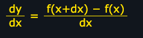
  - 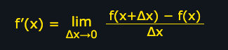
- The process of finding a derivative is called `"differentiation"`. `You do differentiation ... to get a derivative`.
- what is the `derivative of sin(x)`
  - `d/dx(sin(x)) = cos(x)` or `sin(x)’ = cos(x)`
- `Derivative Rules`
  - `Source Link : https://www.mathsisfun.com/calculus/derivatives-rules.html`
  - 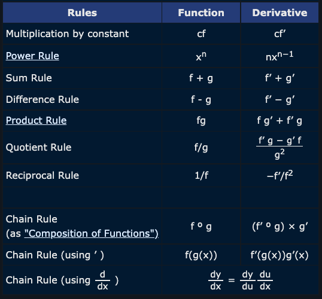
  - 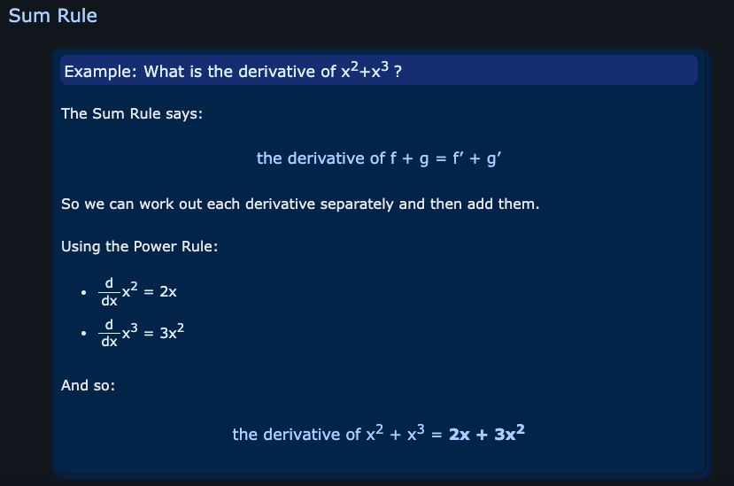
  - 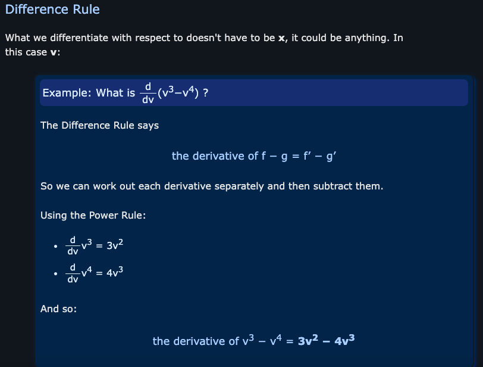
  - 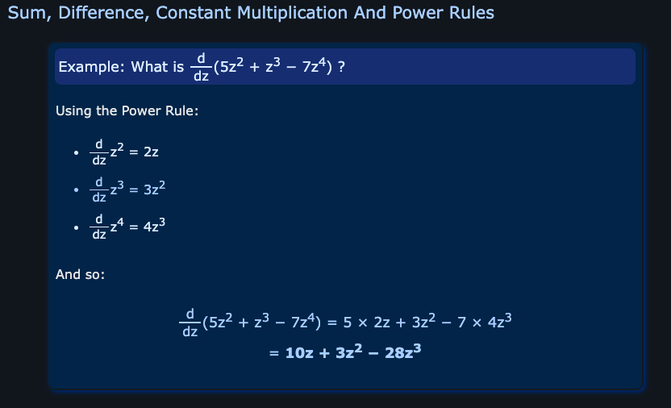
  - 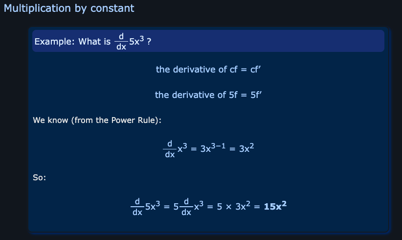
  - 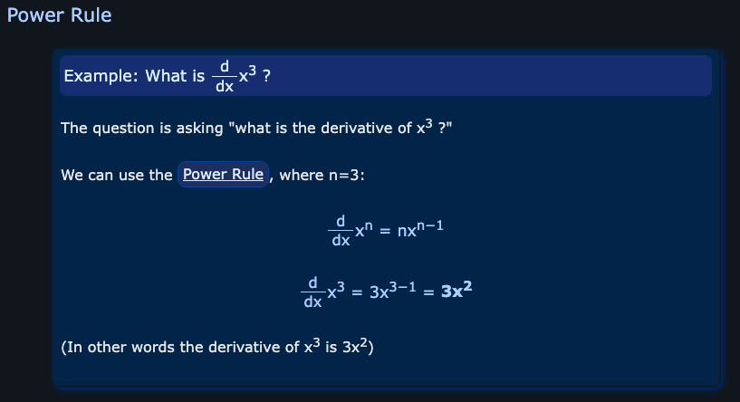
  - 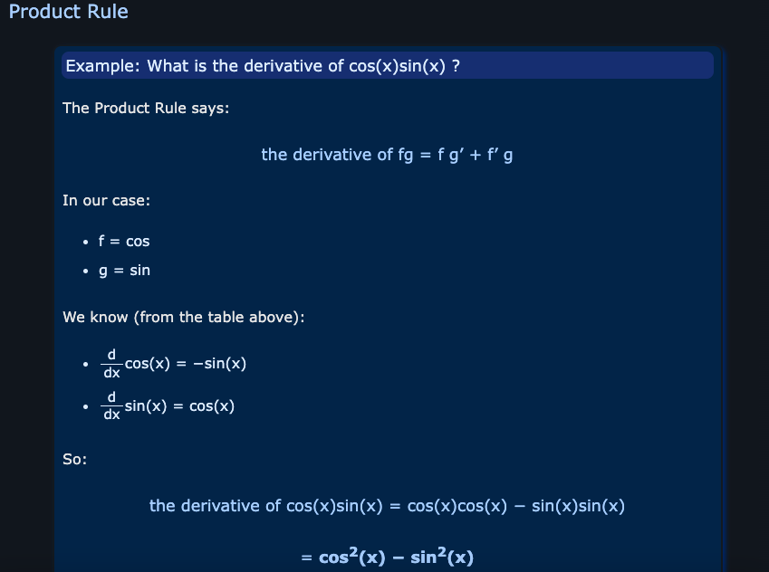        
  - 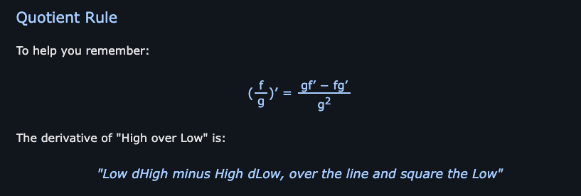          
  - 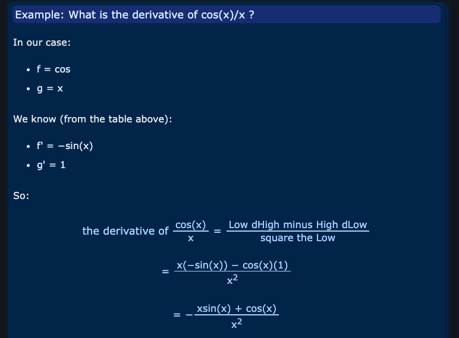 
  - 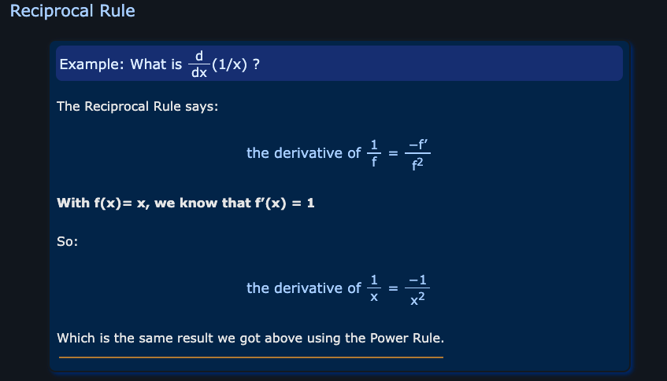  
  - 
  - 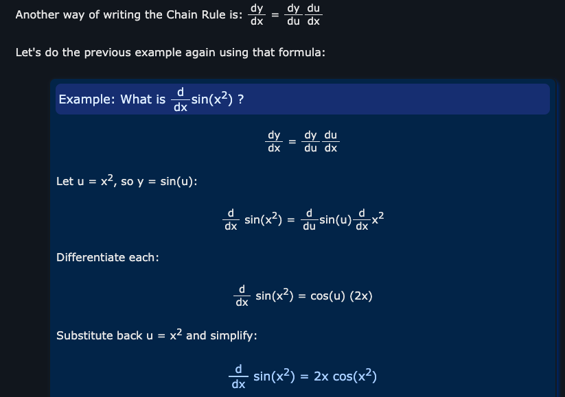
  - 

### Reference Articles
- https://medium.com/@jamesetaylor/create-a-derivative-calculator-in-python-72ee7bc734a4
- https://www.marksmath.org/classes/DiscourseArchive/AnalysisSpring2016/t/nice-plot-of-a-function-together-with-its-derivative/19/
- https://www.geeksforgeeks.org/how-to-calculate-and-plot-the-derivative-of-a-function-using-python-matplotlib/
- https://stackoverflow.com/questions/16841729/how-do-i-compute-the-derivative-of-an-array-in-python
- https://www.geeksforgeeks.org/how-to-compute-derivative-using-numpy/
- https://www.codegrepper.com/code-examples/python/how+to+calculate+derivatives+in+python
- https://stackoverflow.com/questions/53494790/python-derivative-of-trig-functions
- https://machinelearningmastery.com/derivative-of-the-sine-and-cosine/
- https://plotly.com/python/v3/numerical-differentiation/
